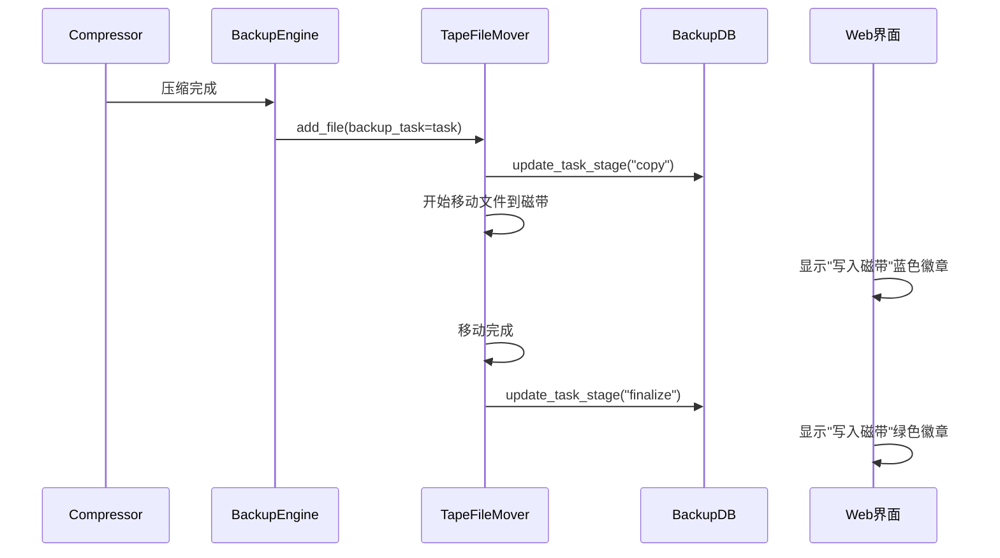

# 磁带移动徽章状态更新说明

## 概述

本文档说明备份系统中磁带移动时任务卡片徽章状态更新功能的实现。该功能确保当压缩文件开始向磁盘（磁带机）移动时，备份任务卡片上的"写入磁带"徽章会亮起，移动完成后暗下。

## 功能描述

### 用户界面效果

在 `http://192.168.0.28:5555/backup` 页面中，当备份任务运行时：

1. **开始移动时**：任务卡片中的"写入磁带"徽章显示为 **蓝色**（`bg-primary`）
2. **移动完成时**："写入磁带"徽章变为 **绿色**（`bg-success`）
3. **未开始时**："写入磁带"徽章显示为 **灰色**（`bg-secondary`）

### 阶段定义

系统定义了以下操作阶段：

```python
STAGE_FLOW_DEFINITION = [
    ("scan", "扫描文件"),
    ("compress", "压缩/打包"),
    ("copy", "写入磁带"),    # 关键阶段
    ("finalize", "完成"),
]
```

## 技术实现

### 1. 后端状态管理

#### 1.1 TapeFileMover 增强

**文件**: `backup/tape_file_mover.py`

**关键修改**：

1. **MoveTask 数据结构**：
   ```python
   @dataclass
   class MoveTask:
       source_path: str
       backup_set: BackupSet
       group_idx: int
       callback: Optional[Callable] = None
       backup_task: Optional = None  # 新增：备份任务对象
   ```

2. **add_file 方法**：
   ```python
   def add_file(self, source_path: str, backup_set: BackupSet, group_idx: int,
                callback: Optional[Callable] = None, backup_task: Optional = None) -> bool:
   ```

3. **状态更新逻辑**：
   ```python
   # 开始移动时
   if task.backup_task:
       backup_db.update_task_stage(task.backup_task, "copy")  # 设置为"写入磁带"

   # 移动完成时
   if task.backup_task:
       backup_db.update_task_stage(task.backup_task, "finalize")  # 设置为"完成"
   ```

#### 1.2 BackupDB 状态更新

**文件**: `backup/backup_db.py`

**新增方法**：
```python
def update_task_stage(self, backup_task: BackupTask, stage_code: str):
    """更新任务的操作阶段（同步方法）

    Args:
        backup_task: 备份任务对象
        stage_code: 阶段代码（scan/compress/copy/finalize）
    """
```

**支持的数据库**：
- **openGauss**: 使用原生 SQL 更新
- **其他数据库**: 使用 SQLAlchemy 更新

#### 1.3 BackupEngine 集成

**文件**: `backup/backup_engine.py`

**关键修改**：在调用 `tape_file_mover.add_file()` 时传入 `backup_task` 参数：
```python
added = self.tape_file_mover.add_file(
    compressed_file['path'],
    backup_set,
    current_group_idx,
    callback=move_callback,
    backup_task=backup_task  # 新增：传入任务对象以支持状态更新
)
```

### 2. 前端徽章显示

#### 2.1 阶段信息API

**文件**: `web/api/backup.py`

**Stage 信息生成**：
```python
def get_stage_info(status, stage_code=None):
    """根据任务状态和当前阶段生成阶段信息"""

    # 为每个阶段设置状态
    for idx, (code, label) in enumerate(STAGE_FLOW_DEFINITION):
        if idx < current_index:
            state = "done"      # 已完成（绿色）
        elif idx == current_index:
            state = "current"   # 进行中（蓝色）
        else:
            state = "pending"   # 未开始（灰色）
```

#### 2.2 前端徽章样式

**文件**: `web/static/js/pages/backup.js`

**徽章样式逻辑**：
```javascript
function getStageBadgeClass(state) {
    switch ((state || '').toLowerCase()) {
        case 'done':
            return 'bg-success';    // 绿色 - 完成
        case 'current':
            return 'bg-primary';    // 蓝色 - 进行中
        case 'pending':
        default:
            return 'bg-secondary';  // 灰色 - 未开始
    }
}
```

**徽章渲染**：
```javascript
${stageSteps.map(step =>
    `<span class="badge ${getStageBadgeClass(step.state)}">${step.label}</span>`
).join('')}
```

### 3. 完整工作流程



## 测试验证

### 测试程序

**文件**: `test_tape_badge_status.py`

**测试内容**：
1. 创建备份任务并压缩文件
2. 将文件加入磁带移动队列
3. 验证状态更新触发
4. 通过Web界面观察徽章变化

**运行方法**：
```bash
python test_tape_badge_status.py
```

**预期结果**：
- 开始移动时：Web界面中"写入磁带"徽章变蓝
- 移动完成时："写入磁带"徽章变绿

### 验证步骤

1. **启动测试程序**：
   ```bash
   python test_tape_badge_status.py
   ```

2. **观察Web界面**：
   - 打开 `http://192.168.0.28:5555/backup`
   - 查看对应任务卡片的阶段徽章

3. **验证状态变化**：
   - **压缩阶段**：只有"压缩/打包"徽章为蓝色
   - **移动开始**："写入磁带"徽章变为蓝色
   - **移动完成**："写入磁带"徽章变为绿色

## 配置要求

### 必要配置

确保系统配置支持通过final目录移动：
```python
# config/settings.py
COMPRESS_DIRECTLY_TO_TAPE = False  # 必须为False以确保有移动过程
COMPRESSION_METHOD = 'pgzip'        # 或其他压缩方法
```

### 数据库支持

系统支持以下数据库：
- **openGauss**: 使用原生 SQL 更新
- **PostgreSQL/MySQL**: 使用 SQLAlchemy 更新
- **SQLite**: 使用 SQLAlchemy 更新

## 故障排除

### 常见问题

1. **徽章不更新**：
   - 检查 `backup_task.id` 是否存在
   - 确认数据库连接正常
   - 查看日志中的状态更新错误

2. **状态更新失败**：
   ```python
   # 检查日志
   logger.warning(f"更新任务状态失败: {str(stage_error)}")
   ```

3. **前端不显示**：
   - 检查 API 返回的 `stage_steps` 数据
   - 确认前端 JavaScript 无错误
   - 验证 CSS 样式正确加载

### 调试方法

1. **后端日志**：
   ```python
   logger.info(f"任务 {task_id} 阶段更新为: {stage_code}")
   ```

2. **API 检查**：
   ```bash
   curl http://192.168.0.28:5555/api/backup/running-tasks
   ```

3. **前端调试**：
   ```javascript
   console.log('Stage steps:', task.stage_steps);
   ```

## 总结

该功能实现了以下关键特性：

1. **实时状态更新**：磁带移动开始和完成时实时更新任务状态
2. **视觉反馈**：通过徽章颜色变化提供直观的用户反馈
3. **数据库兼容**：支持多种数据库后端
4. **异步处理**：状态更新不阻塞主要的备份流程
5. **错误处理**：完善的异常处理确保系统稳定性

通过这个功能，用户可以在Web界面中清楚地看到备份任务的当前阶段，特别是磁带写入操作的状态，提供了更好的用户体验和系统可观测性。